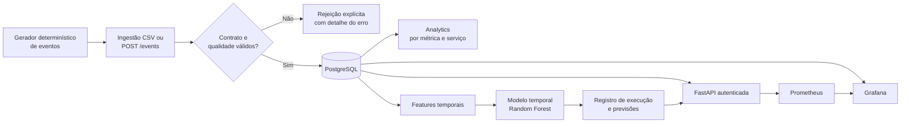

# NEXUS AI Ops

> MVP local de AIOps para transformar eventos operacionais sintéticos em dados validados, análises, sinais de risco de ML e uma API observável.

O NEXUS não é uma plataforma de produção nem promete "prever incidentes" de forma autônoma. É uma base técnica reproduzível para demonstrar como as disciplinas de dados, backend, ML e operações se conectam em um fluxo de AIOps auditável.

## O problema que o projeto resolve

Times de tecnologia recebem telemetria em grande volume: CPU, memória, latência e erros. Sem um contrato comum, validação e priorização, esses dados viram ruído. O NEXUS organiza o caminho entre um evento operacional e um sinal que pode apoiar uma investigação:



O fluxo é deliberadamente separável: cada bloco pode ser substituído sem reescrever os demais. Por exemplo, o CSV sintético pode dar lugar a um conector de observabilidade; o controle local por API key pode ser substituído por SSO; o banco local pode migrar para um serviço gerenciado.

## O que está implementado

| Camada | Implementação atual | Decisão técnica |
| --- | --- | --- |
| Contrato de dados | `OperationalEvent` imutável, com ID, timestamp UTC, serviço, host, métrica, valor, severidade e rótulo sintético | Um único contrato reduz formatos paralelos e torna o pipeline testável. |
| Dados | Geradores sintéticos fixos e temporais, determinísticos por seed | Demonstração e testes repetíveis; não representa telemetria real. |
| Qualidade | Regras para duplicidade, ordem temporal, métrica e faixa plausível | Dado inválido é separado de sinal operacional anômalo. |
| Persistência | PostgreSQL 17, SQL explícito, UPSERT por `event_id`, migrations Alembic | Reexecuções são idempotentes e o schema é versionado. |
| Analytics | Agregações por métrica e priorização de serviços | Incidente ainda é um sinal derivado, não uma entidade de negócio definitiva. |
| ML | `IsolationForest` por métrica e `RandomForest` temporal com split cronológico 60/20/20 | Evita comparar unidades incompatíveis e reduz vazamento temporal. |
| API | FastAPI, healthcheck público e endpoints operacionais autenticados | A API lê/escreve dados; não treina modelo dentro de uma requisição HTTP. |
| Observabilidade | métricas Prometheus e dashboard Grafana provisionado | Mede o comportamento da própria API e exibe dados operacionais persistidos. |
| Qualidade de entrega | pytest, Ruff, GitHub Actions e Compose | Validação automatizada antes de integrar mudanças. |

## Demonstração reproduzível

Com Docker iniciado e o ambiente Python instalado, o comando abaixo aplica migrations, gera três dias de eventos, executa a validação de qualidade, persiste os aprovados e registra uma execução de modelo. Ele não apaga dados existentes.

```powershell
.\.venv\Scripts\python.exe scripts/run_demo.py
```

Resultado esperado do cenário padrão: **3.456 eventos** (4 séries a cada 5 minutos por 3 dias) e previsões persistidas de uma execução temporal. Como a geração é determinística, resultados podem ser comparados entre máquinas e mudanças de código.

Depois, exponha a API e a observabilidade:

```powershell
.\.venv\Scripts\uvicorn.exe nexus.api.app:app --reload
docker compose --profile observability up -d
```

| Serviço | Endereço | Finalidade |
| --- | --- | --- |
| API e Swagger | [http://localhost:8000/docs](http://localhost:8000/docs) | Exercitar os endpoints. |
| Métricas | [http://localhost:8000/metrics](http://localhost:8000/metrics) | Exposição Prometheus. |
| Grafana | [http://localhost:3000](http://localhost:3000) | Dashboard `NEXUS / NEXUS API Overview`. |
| Prometheus | [http://localhost:9090](http://localhost:9090) | Inspeção das séries coletadas. |

## Processo técnico em detalhe

1. O gerador cria eventos com timestamp UTC e padrões temporais, incluindo janelas controladas de degradação.
2. A ingestão converte o CSV ou payload HTTP para o contrato de domínio. Tipos e campos obrigatórios são validados antes de tocar o banco.
3. O validador de qualidade analisa o lote. Erro de formato impede a entrada; problemas de qualidade são reportados de forma explícita.
4. O repositório PostgreSQL persiste eventos aprovados. `event_id` é chave primária e o UPSERT impede duplicação em uma nova execução.
5. Analytics calcula volume, média, mínimo, máximo e anomalias por métrica; serviços são ordenados por sinais anômalos e críticos.
6. O pipeline temporal cria lags, janelas móveis, desvio da janela anterior e hora do dia. O modelo aprende somente com a partição de treino; o limiar é escolhido na validação e o teste fica isolado até o fim.
7. A execução do modelo registra metadados, métricas e previsões no PostgreSQL. O artefato `joblib` permanece local e ignorado pelo Git.
8. A FastAPI disponibiliza o estado persistido. Exceto `/health`, os endpoints exigem `X-NEXUS-API-Key` com papel `reader`.
9. Middleware registra `X-Request-ID`, duração e status. Prometheus coleta as métricas; Grafana combina essas séries com consultas ao PostgreSQL.

Consulte [a arquitetura detalhada](docs/architecture.md) para os limites e decisões de cada etapa.

## Stack

- **Python 3.13**: domínio, pipeline, API e scripts.
- **FastAPI + Uvicorn**: interface HTTP e documentação OpenAPI automática.
- **PostgreSQL 17 + psycopg 3 + Alembic**: dados transacionais e schema versionado.
- **scikit-learn + joblib**: baselines de anomalia e risco temporal.
- **Docker Compose**: ambiente local de banco e observabilidade.
- **Prometheus + Grafana**: métricas e visualização operacional.
- **pytest + Ruff + GitHub Actions**: testes, lint, formatação e CI.

## Execução local

Pré-requisitos: Python 3.13, Docker Desktop com o daemon ativo e Git. As imagens, containers e volumes Docker podem ficar no disco configurado pelo Docker Desktop; o código e `.venv` permanecem no diretório do projeto.

```powershell
Copy-Item .env.example .env
# Edite .env: use senhas locais fortes e defina NEXUS_API_KEYS.

python -m venv .venv
.\.venv\Scripts\Activate.ps1
python -m pip install --upgrade pip
python -m pip install -e ".[dev]"

docker compose up -d postgres
python -m alembic upgrade head
pytest
ruff check .
ruff format --check .
```

O guia completo, inclusive comandos de integração e solução de problemas, está em [docs/local-development.md](docs/local-development.md).

## Segurança e limites

- `.env`, dados gerados, modelos e vídeos locais são ignorados pelo Git. Nunca faça commit de credenciais.
- A autenticação atual é adequada apenas como controle local máquina-a-máquina. Não substitui gestão de identidade, rotação de segredo, TLS ou auditoria corporativa.
- Os dados são sintéticos e os rótulos existem para avaliar os baselines. Métricas de ML não devem ser interpretadas como desempenho em produção.
- Não há conectores externos, SSO, alertas, remediação automática, feature store, MLflow ou ciclo de vida gerenciado de modelos.

## Validação

O repositório mantém testes unitários e de integração, e o CI executa testes e verificações Ruff a cada push e pull request. A validação local completa inclui:

```powershell
$env:RUN_POSTGRES_INTEGRATION = "1"
pytest
ruff check .
ruff format --check .
docker compose config --quiet
```

## Documentação

- [Arquitetura e decisões técnicas](docs/architecture.md)
- [Guia de desenvolvimento e operação local](docs/local-development.md)
- [Contrato de eventos operacionais](docs/event-contract.md)
- [Estratégia de testes e CI](docs/testing-and-ci.md)
- [Roteiro de demonstração para portfólio](docs/portfolio-demo.md)
- [ADRs](docs/adr/): decisões arquiteturais registradas no tempo.

## Referência de apresentação

A organização desta documentação foi inspirada no padrão de clareza e fluxo do projeto [FortaDocs — Termos de Responsabilidade](https://github.com/LucasNicotari/fortatech-termos-responsabilidade), mas a arquitetura, o domínio e a implementação do NEXUS são independentes.
