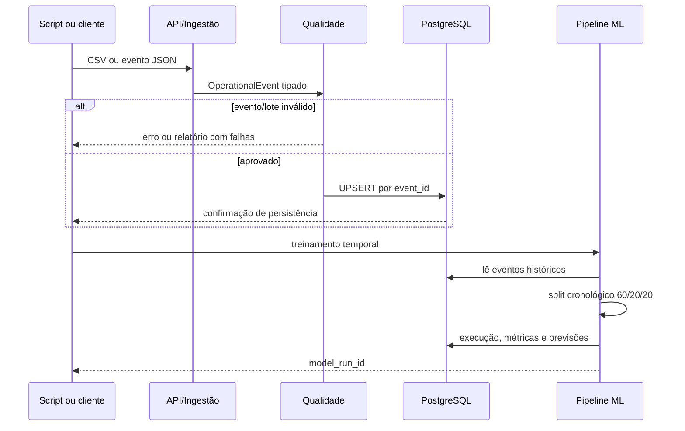

# Arquitetura do NEXUS AI Ops

## Decisão central

O NEXUS usa uma arquitetura em camadas. O domínio não depende de FastAPI, PostgreSQL, Docker ou Grafana. Isso reduz acoplamento e permite trocar interfaces e infraestrutura sem alterar as regras de negócio e de qualidade.

```mermaid
flowchart TB
    subgraph Inputs[Entradas]
      CSV[CSV sintético]
      HTTP[POST /events]
    end
    subgraph Core[Núcleo Python]
      Domain[OperationalEvent]
      Ingestion[Ingestão e parsing]
      Quality[Validação de qualidade]
      Analytics[Analytics]
      ML[Features e modelos]
    end
    subgraph Data[Dados]
      PG[(PostgreSQL)]
      Model[Artefato joblib local]
    end
    subgraph Interfaces[Interfaces e observabilidade]
      API[FastAPI]
      Metrics[/metrics]
      Prom[Prometheus]
      Grafana[Grafana]
    end
    CSV --> Ingestion
    HTTP --> API --> Domain
    Ingestion --> Domain --> Quality
    Quality --> PG
    PG --> Analytics
    PG --> ML
    ML --> Model
    ML --> PG
    PG --> API
    Analytics --> API
    API --> Metrics --> Prom --> Grafana
    PG --> Grafana
```

## Responsabilidades por componente

| Componente | Responsabilidade | Não faz |
| --- | --- | --- |
| `nexus.domain` | Define o contrato imutável de um evento operacional | Não conhece HTTP nem SQL. |
| `nexus.ingestion` | Converte CSV em eventos tipados | Não classifica anomalia. |
| `nexus.quality` | Aplica regras do lote e produz relatório | Não descarta silenciosamente dados. |
| `nexus.infrastructure.postgres` | Executa SQL e mapeia persistência | Não contém regra de ML. |
| `nexus.analytics` | Resume métricas e prioriza sinais | Não declara incidente definitivo. |
| `nexus.ml` | Cria features, treina e avalia baselines | Não é chamado durante uma requisição HTTP. |
| `nexus.api` | Expõe contratos HTTP, autorização e métricas | Não cria tabelas automaticamente. |
| Compose | Sobe infraestrutura local reproduzível | Não substitui uma plataforma de produção. |

## Ciclo de dados



## Persistência e idempotência

O banco é criado exclusivamente por migrations Alembic. A aplicação não emite DDL implícito. Cada `event_id` é a chave primária; portanto, uma segunda carga do mesmo dataset atualiza o registro em vez de criar duplicatas. Esse detalhe torna `scripts/run_demo.py` seguro para reapresentar o projeto sem limpar o banco.

As previsões e metadados de uma execução de modelo também ficam no PostgreSQL. O arquivo serializado do modelo fica em `data/models/` e é local: ele pode ser regenerado e não deve ser versionado.

## Estratégia de ML

Há dois baselines com propósitos distintos:

| Baseline | Uso | Proteção principal |
| --- | --- | --- |
| Isolation Forest | Detectar comportamento incomum sem usar rótulo no treinamento | Um modelo por métrica; CPU percentual não é comparada a latência em ms. |
| Random Forest temporal | Estimar risco usando contexto temporal | Separação cronológica 60% treino, 20% validação, 20% teste. |

As features temporais incluem atraso, média móvel, desvio padrão móvel, diferença contra janela anterior e hora do dia. O limiar do alerta é escolhido na validação; o conjunto de teste não participa desse ajuste. Esta separação é importante: escolher limiar usando o teste daria uma métrica otimista e enganosa por vazamento de futuro.

## Observabilidade do próprio sistema

O middleware da API cria ou propaga `X-Request-ID`, registra conclusão de cada chamada e alimenta as métricas `nexus_api_requests_total` e `nexus_api_request_duration_seconds`. Prometheus coleta `/metrics`. O Grafana tem duas fontes de verdade explícitas:

- Prometheus para taxa, rota, status e latência da API;
- PostgreSQL para total de eventos, anomalias e serviços com sinais críticos.

Isso evita apresentar painéis que parecem analíticos, mas dependem apenas de dados voláteis da aplicação.

## Fronteiras de produção

Para uma evolução corporativa, os próximos componentes seriam conectores de telemetria, fila/stream, gestão de identidade, secret manager, TLS, alertas, retenção, monitoramento de drift, feature store e registro de modelos. Eles não foram simulados como se estivessem prontos: incluí-los sem requisitos operacionais e de segurança aumentaria o escopo sem aumentar a confiabilidade do MVP.
